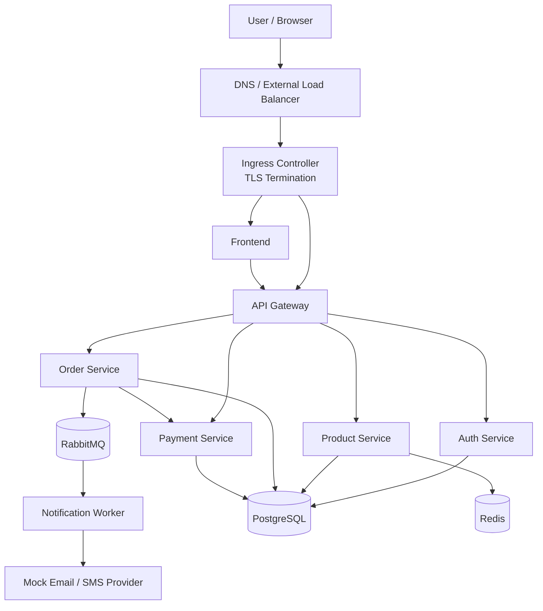
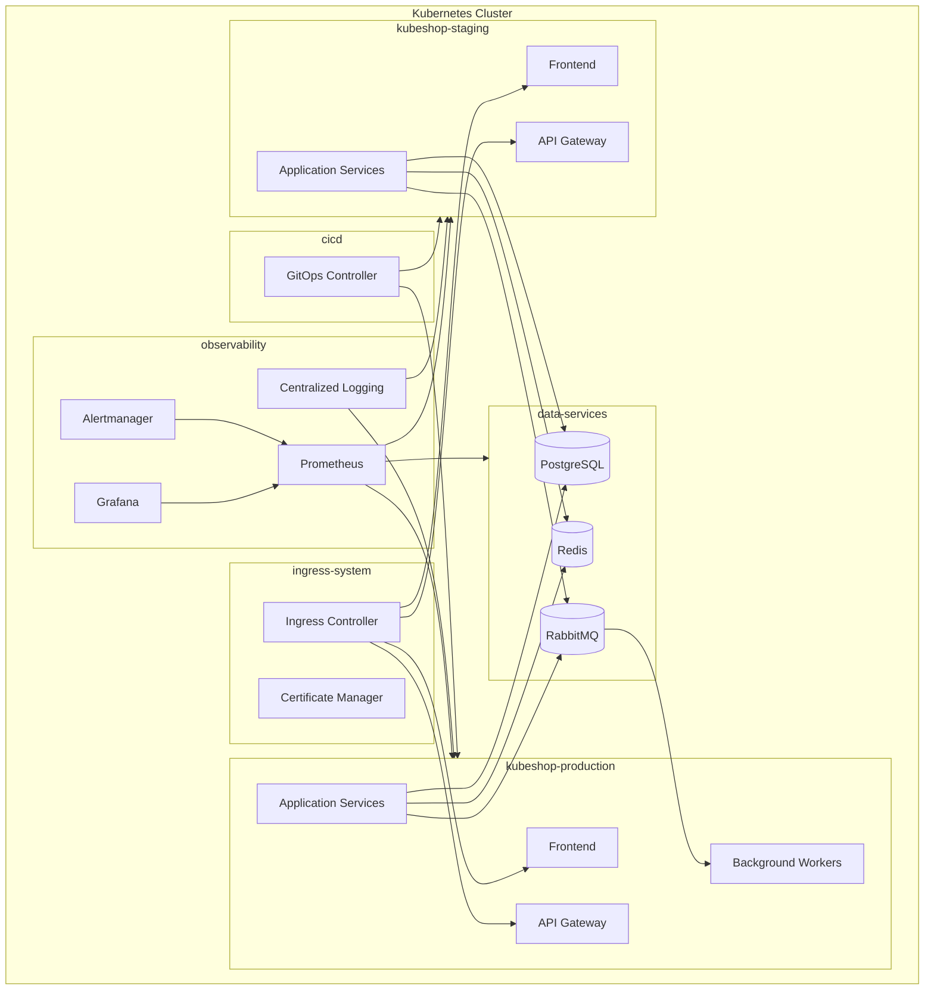
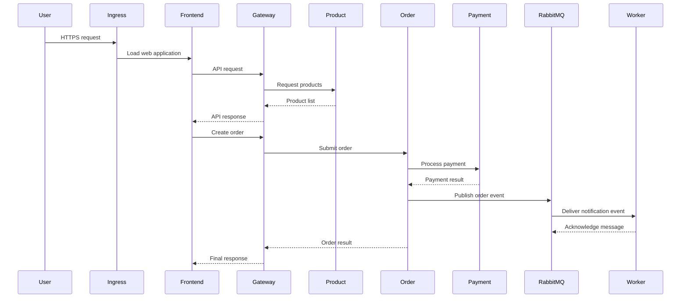

# KubeShop Kubernetes Platform

KubeShop is a hands-on DevOps project that simulates the deployment and operation of a production-style e-commerce platform on Kubernetes.

The application follows a microservices architecture and includes stateless application services, stateful data services, asynchronous messaging, observability, autoscaling, security controls, CI/CD, and disaster-recovery requirements.

The primary goal is not to build a complete e-commerce application. The application services may be simple demo or mock APIs. The main focus is designing and operating the Kubernetes platform around them.

---

## Project Goals

This project is designed to practice the following areas:

- Kubernetes workload design
- Microservice deployment
- Service discovery
- Ingress and TLS termination
- Persistent storage
- Configuration and secret management
- Horizontal autoscaling
- High availability
- Network security
- Role-based access control
- Monitoring, logging, and alerting
- CI/CD and GitOps
- Backup and disaster recovery
- Failure testing and operational readiness

---

## Business Scenario

KubeShop is an online store where users can:

- Sign in to their accounts
- Browse and search products
- View product details
- Create orders
- Perform simulated payments
- Track order status
- Receive order notifications

Traffic may increase significantly during promotional campaigns. The platform must scale automatically, remain available during pod or node failures, and support safe application deployments without noticeable downtime.

---

## System Architecture



---

## Application Components

### Frontend

The Frontend is the web interface of the store.

Responsibilities:

- Display products
- Authenticate users
- Submit orders
- Display payment results
- Show order status

The Frontend is stateless and should run with multiple replicas.

External access is provided through the Ingress Controller.

---

### API Gateway

The API Gateway is the main entry point for backend requests.

Responsibilities:

- Route requests to the correct microservice
- Perform initial token validation
- Apply rate limiting
- Manage upstream timeouts
- Generate or propagate request IDs
- Centralize selected API policies

Example routes:

```text
/api/auth       -> Auth Service
/api/products   -> Product Service
/api/orders     -> Order Service
/api/payments   -> Payment Service
```

The API Gateway should run with at least two replicas distributed across different worker nodes.

---

### Auth Service

The Auth Service manages authentication and basic user identity operations.

Responsibilities:

- Authenticate users
- Issue JWTs
- Validate tokens
- Manage basic user data
- Manage sessions or token revocation when required

Dependencies:

- PostgreSQL
- Redis, when used for sessions or token revocation

---

### Product Service

The Product Service provides product and inventory-related APIs.

Responsibilities:

- List products
- Search products
- Return product details
- Check inventory
- Cache frequently requested data

Dependencies:

- PostgreSQL
- Redis

PostgreSQL is the source of truth. Redis is used only as a cache or for temporary data.

---

### Order Service

The Order Service handles the order lifecycle.

Responsibilities:

- Create orders
- Update order status
- Request payment processing
- Store order results
- Publish order events to the message broker

Possible order states:

```text
Pending
PaymentProcessing
Paid
Preparing
Shipped
Failed
Cancelled
```

Dependencies:

- PostgreSQL
- Payment Service
- RabbitMQ

---

### Payment Service

The Payment Service is a mock external payment provider.

It should be able to simulate:

- Successful payments
- Failed payments
- Delayed responses
- Request timeouts
- Temporary errors
- Duplicate callbacks
- Connection failures

The purpose of this service is to test how the platform behaves when an external dependency becomes slow, unavailable, or unreliable.

---

### Notification Worker

The Notification Worker consumes asynchronous messages from RabbitMQ.

Responsibilities:

- Send simulated emails
- Send simulated SMS notifications
- Record notification events
- Retry failed messages
- Move permanently failed messages to a dead-letter queue

The worker is internal and must not be exposed directly to the internet.

---

## Infrastructure Services

### PostgreSQL

PostgreSQL stores persistent business data.

Stored data includes:

- Users
- Products
- Orders
- Payments
- Transaction status

PostgreSQL must use persistent storage. Restarting or replacing the database pod must not delete application data.

For the base version of the project, one persistent PostgreSQL instance is sufficient. PostgreSQL replication or an operator-based high-availability deployment can be added later.

---

### Redis

Redis stores temporary and reconstructable data.

Possible use cases:

- Product cache
- Rate limiting
- Sessions
- Token revocation lists
- Temporary application state

Redis must not be the source of truth for orders or payments.

Losing Redis data must not result in permanent business-data loss.

---

### RabbitMQ

RabbitMQ provides asynchronous communication between services.

Suggested queues or routing keys:

```text
order.created
payment.completed
payment.failed
notification.email
notification.sms
dead-letter
```

RabbitMQ should use persistent storage when message durability is required.

---

## Kubernetes Architecture



---

## Kubernetes Namespaces

### `ingress-system`

Contains cluster ingress components.

Suggested components:

- Ingress Controller
- Certificate Manager
- TLS-related configuration

---

### `kubeshop-staging`

Contains the staging version of the application.

Used for:

- Integration testing
- Smoke testing
- Deployment validation
- Testing application changes before production

---

### `kubeshop-production`

Contains the production application workloads.

Access to this namespace should be restricted and managed through RBAC.

---

### `data-services`

Contains stateful infrastructure services.

Components:

- PostgreSQL
- Redis
- RabbitMQ

This namespace should have strict access controls and restrictive network policies.

For stronger environment isolation, separate staging and production data services may be deployed in different namespaces or clusters.

---

### `observability`

Contains monitoring, logging, and alerting components.

Suggested components:

- Prometheus
- Grafana
- Alertmanager
- Log collectors
- Log storage and search platform

---

### `cicd`

Contains GitOps or deployment automation components.

---

## Traffic Flow



---

## External Request Path

External requests follow this path:

```text
Internet
   |
   v
External Load Balancer
   |
   v
Ingress Controller
   |
   +--> Frontend
   |
   +--> API Gateway
```

Only the Frontend and API Gateway should be externally accessible.

The following components must remain internal:

- Auth Service
- Product Service
- Order Service
- Payment Service
- Notification Worker
- PostgreSQL
- Redis
- RabbitMQ

---

## Service Discovery

Internal communication must use Kubernetes Services and cluster DNS.

Example internal DNS names:

```text
auth-service.kubeshop-production.svc.cluster.local
product-service.kubeshop-production.svc.cluster.local
order-service.kubeshop-production.svc.cluster.local
postgresql.data-services.svc.cluster.local
rabbitmq.data-services.svc.cluster.local
```

Services must not communicate through direct pod IP addresses.

---

## Workload Types

The following stateless components should run as Deployments:

- Frontend
- API Gateway
- Auth Service
- Product Service
- Order Service
- Payment Service
- Notification Worker

The following stateful components may run as StatefulSets or be managed through Kubernetes operators:

- PostgreSQL
- RabbitMQ
- Redis, when persistence is enabled

---

## Suggested Production Replicas

| Service | Minimum replicas |
|---|---:|
| Frontend | 2 |
| API Gateway | 2 |
| Auth Service | 2 |
| Product Service | 2 |
| Order Service | 2 |
| Payment Service | 2 |
| Notification Worker | 1 or more |

Replicas of the same service should be distributed across different nodes.

---

## Health Checks

Each service should expose suitable health endpoints.

### Liveness Probe

Determines whether the application process is alive or should be restarted.

### Readiness Probe

Determines whether the pod is ready to receive traffic.

A pod must not be added to the Service endpoints before its required initialization has completed.

### Startup Probe

Protects applications with long startup times from being restarted too early by the liveness probe.

---

## Resource Management

Every container should define:

- CPU requests
- CPU limits
- Memory requests
- Memory limits

Resource values should be tuned using load tests and monitoring data rather than selected arbitrarily.

---

## Autoscaling

Suitable workloads for Horizontal Pod Autoscaling include:

- API Gateway
- Product Service
- Order Service
- Frontend

Possible scaling signals:

- CPU utilization
- Memory utilization
- HTTP request rate
- Response latency
- Queue length

Queue length is usually a more relevant scaling signal than CPU usage for the Notification Worker.

KEDA may be added to scale workers based on RabbitMQ queue depth.

---

## High Availability

The platform should use the following mechanisms where appropriate:

- Multiple replicas
- Pod anti-affinity
- Topology spread constraints
- Pod disruption budgets
- Readiness probes
- Rolling updates
- Graceful shutdown
- Distribution across worker nodes

A single pod or worker-node failure should not make the entire application unavailable.

---

## Persistent Storage

The following components require persistent storage:

- PostgreSQL
- RabbitMQ
- Redis, if persistence is enabled
- In-cluster log storage, when applicable

Storage design should consider:

- StorageClass
- Access mode
- Initial capacity
- Volume expansion
- Reclaim policy
- Snapshots
- Backup
- Restore

---

## Configuration Management

Non-sensitive configuration should be stored in ConfigMaps.

Examples:

- Internal service URLs
- Log level
- Timeout values
- Queue names
- Feature flags
- Retry limits

---

## Secret Management

Sensitive values should be managed through Kubernetes Secrets or an external secret-management system.

Examples:

- Database passwords
- JWT signing keys
- RabbitMQ credentials
- SMTP credentials
- Container registry credentials
- External API keys

Secrets must not be committed to Git or embedded in container images.

A more advanced version of the project may use:

- External Secrets Operator
- HashiCorp Vault
- Cloud-provider secret managers
- Sealed Secrets

---

## Network Security

NetworkPolicies should restrict communication between workloads.

Suggested communication model:

```text
Frontend             -> API Gateway
API Gateway          -> Auth Service
API Gateway          -> Product Service
API Gateway          -> Order Service
API Gateway          -> Payment Service
Auth Service         -> PostgreSQL
Product Service      -> PostgreSQL
Product Service      -> Redis
Order Service        -> PostgreSQL
Order Service        -> Payment Service
Order Service        -> RabbitMQ
Notification Worker  -> RabbitMQ
Notification Worker  -> Notification Provider
```

A default-deny model should be used where supported, followed by explicit allow rules for required traffic.

DNS access must also be allowed for workloads that depend on Kubernetes service discovery.

---

## RBAC

Cluster and namespace access should follow the principle of least privilege.

### Developer

Suggested permissions:

- View staging pods
- View staging logs
- Perform limited staging workload restarts
- No access to production secrets

### DevOps Engineer

Suggested permissions:

- Manage workloads
- View events and logs
- Manage Deployments, Services, and Ingress resources
- Controlled production access

### Read-Only User

Suggested permissions:

- View resources
- View cluster status
- View metrics
- No modification permissions

Daily operations should not rely on unrestricted cluster-admin access.

---

## Container Security

Recommended controls:

- Run processes as a non-root user
- Use a read-only root filesystem where possible
- Drop unnecessary Linux capabilities
- Prevent privileged containers
- Define security contexts
- Use dedicated ServiceAccounts
- Disable unnecessary ServiceAccount token mounting
- Scan container images
- Pin image versions
- Avoid the `latest` tag
- Use trusted and minimal base images
- Prevent secrets from being written to logs

---

## CI/CD Flow

```mermaid
flowchart LR
    Commit[Git Commit]
    Test[Test and Lint]
    Build[Build Container Image]
    Scan[Security Scan]
    Registry[Push to Registry]
    Staging[Deploy to Staging]
    Smoke[Smoke Test]
    Approval[Approval]
    Production[Deploy to Production]
    Monitor[Monitor Rollout]

    Commit --> Test
    Test --> Build
    Build --> Scan
    Scan --> Registry
    Registry --> Staging
    Staging --> Smoke
    Smoke --> Approval
    Approval --> Production
    Production --> Monitor
```



Container image versions must be traceable.

Example tags:

```text
order-service:1.4.2
order-service:git-a82f631
```

Production deployments must not use mutable tags such as `latest`.

---

## Deployment Strategy

The base project uses rolling updates.

Expected behavior:

- Keep healthy replicas available during rollout
- Wait for new pods to become ready before routing traffic
- Allow active requests to complete before terminating old pods
- Support rollback to the previous version
- Monitor error rate and latency during deployment
- Prevent unhealthy versions from completing the rollout

Canary or blue-green deployment can be added as an advanced feature.

---

## Observability

The platform should provide visibility into cluster health, application behavior, and stateful dependencies.

### Core Metrics

- Node CPU and memory
- Pod CPU and memory
- Pod restart count
- Pod status
- HTTP request rate
- HTTP error rate
- Response latency
- Queue depth
- Database connection count
- Database query latency
- Redis cache hit rate
- Persistent-volume usage
- Successful order count
- Failed order count
- Payment success and failure rate

---

## Dashboards

### Cluster Dashboard

Should display:

- Node health
- CPU usage
- Memory usage
- Disk usage
- Pending pods
- Failed pods
- Restart counts

### Application Dashboard

Should display:

- Request rate
- Error rate
- Latency
- Microservice health
- Order volume
- Payment outcomes

### Data Services Dashboard

Should display:

- PostgreSQL connections
- PostgreSQL query latency
- Redis memory usage
- Redis cache hit rate
- RabbitMQ queue depth
- RabbitMQ consumer count

---

## Logging

Application services should produce structured logs.

Suggested fields:

```text
timestamp
service
environment
level
request_id
trace_id
user_id
order_id
message
```

Sensitive data must not be logged.

Examples of prohibited log data:

- Passwords
- Complete JWTs
- Secrets
- API keys
- Complete payment information

---

## Alerting

Suggested alerts:

- Node is not ready
- Pod is in CrashLoopBackOff
- High pod restart rate
- Increased HTTP 5xx error rate
- High response latency
- Persistent volume is nearly full
- RabbitMQ queue depth is too high
- PostgreSQL is unavailable
- High memory consumption
- No healthy replica is available
- Backup job failed
- TLS certificate is close to expiration

Alerts should be actionable and assigned appropriate severity levels.

---

## Backup and Disaster Recovery

Important backup targets:

- PostgreSQL data
- RabbitMQ data, when required
- Kubernetes manifests
- GitOps repository
- Critical configuration
- Certificate-related data
- Externally managed secrets

Suggested recovery objectives:

```text
RPO: 24 hours
RTO: 2 hours
```

Backups must be restored and tested periodically. A backup that has never been restored should not be considered verified.

---

## Failure Scenarios

The platform should be designed and tested for:

- Deletion of an application pod
- Failure of a worker node
- Container out-of-memory termination
- PostgreSQL unavailability
- Slow Payment Service responses
- External-service timeouts
- Sudden traffic increases
- Rapid queue growth
- Deployment of a broken application version
- Deletion of a database pod
- Persistent-volume exhaustion
- Internal DNS failure
- TLS certificate expiration

---

## Suggested Repository Structure

This project is intended to live inside a repository that contains multiple DevOps project scenarios.

```text
devops-project-labs/
├── README.md
├── projects/
│   ├── kubeshop-kubernetes-platform/
│   │   ├── README.md
│   │   ├── docs/
│   │   │   ├── architecture.md
│   │   │   ├── networking.md
│   │   │   ├── security.md
│   │   │   ├── monitoring.md
│   │   │   ├── backup-restore.md
│   │   │   └── runbooks/
│   │   ├── applications/
│   │   │   ├── frontend/
│   │   │   ├── api-gateway/
│   │   │   ├── auth-service/
│   │   │   ├── product-service/
│   │   │   ├── order-service/
│   │   │   ├── payment-service/
│   │   │   └── notification-worker/
│   │   ├── kubernetes/
│   │   │   ├── base/
│   │   │   ├── staging/
│   │   │   ├── production/
│   │   │   ├── ingress/
│   │   │   ├── data-services/
│   │   │   ├── observability/
│   │   │   ├── network-policies/
│   │   │   ├── rbac/
│   │   │   └── autoscaling/
│   │   ├── monitoring/
│   │   │   ├── dashboards/
│   │   │   ├── alerts/
│   │   │   └── rules/
│   │   ├── ci-cd/
│   │   │   ├── pipelines/
│   │   │   └── gitops/
│   │   └── scripts/
│   │       ├── health-check/
│   │       ├── backup/
│   │       ├── restore/
│   │       └── smoke-test/
│   └── future-project/
└── shared/
    ├── templates/
    ├── scripts/
    └── documentation/
```

---

## Suggested Domains

```text
shop.example.com
api.shop.example.com
staging.shop.example.com
api-staging.shop.example.com
grafana.example.com
```

---

## Project Scope

This project covers the design and operation of the Kubernetes platform required to host a microservice-based application.

Main areas:

- Application workloads
- Networking
- Storage
- Security
- Autoscaling
- Observability
- Deployment automation
- Backup
- Disaster recovery

Implementing complete e-commerce business logic is outside the main scope. Application services may be lightweight APIs or mock services.

---

## Future Improvements

Possible advanced additions:

- GitOps
- Canary deployment
- Blue-green deployment
- Service mesh
- Distributed tracing
- PostgreSQL high availability
- External secret management
- Policy enforcement
- Image signing
- Software Bill of Materials
- KEDA
- Cluster Autoscaler
- Chaos engineering
- Mutual TLS
- Multi-cluster disaster recovery

---

## License

This project is intended for educational, laboratory, and portfolio purposes.
